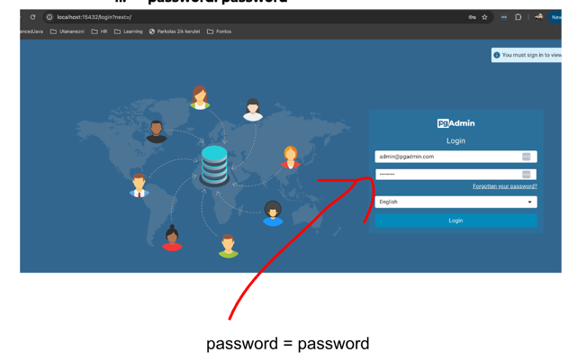

# Library Management System Backend

This Project is the backend of the **Library Management System**.

The Library Management System allows users to browse through the available **books** using different filtering and sorting.

Additionally, the admin is able to
- browse through the **items**, in order to check the available items in the catalog
- manage the **rentals**, including deletion, deadline extension, etc.

## About

### User Roles

- Admin
  - Username: username1
  - Password: admin
- User
  - Username: username2 (or username3)
  - Password: user

### UML Diagram


The image below shows how the UML class diagram of the entities and relationships.

### Swagger documentation

[Click here](http://localhost:8080/swagger-ui/index.html) to go to the Swagger documentation of the Project.

### Requirements

- **IDE:** [IntelliJ IDEA](https://www.jetbrains.com/idea/)
- **Java Version:** 21
- **Project:** Maven

Clone this repository, and open it with IntelliJ. After setting up

### Setting up the database server

1. Run the Docker image in the terminal: ```docker compose up```
2. Use the following link: http://localhost:15432/browser/
3. In the login window, enter the following credentials: 
   1. Email: `admin@pgadmin.com`
   2. Password: `password`

4. In the Dashboard page, click on **Add New Server**

5. Complete the server data:
   1. **Host name/address:** host.docker.internal
   2. **Port:** 55000
   3. **Maintenance database:** postgres
   4. **Username**: postgres
   5. **Password:** postgres

### Setting up the project

Running the `main` function in [LibraryManagementSystemBackendApplication.java](src/main/java/org/ppke/itk/librarymanagementsystembackend/LibraryManagementSystemBackendApplication.java)
sets up the backend, including the Flyway migrations, as well as other parts of the controller

